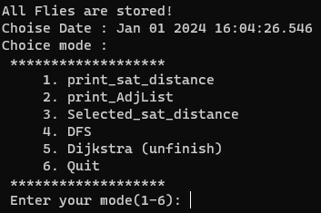
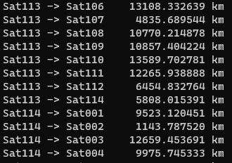
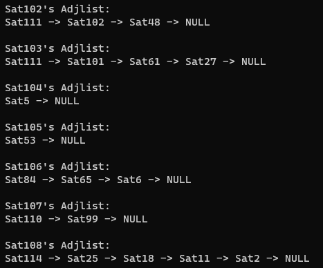
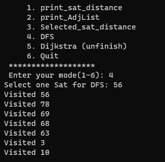
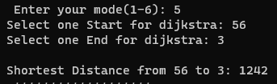

# DS_Project_Sat_Graph_search

程式在初始會隨機選擇一段時間做為當下時間，像下圖挑選到的是2024年1月1號下午4點04分，並且在這時鄰接鏈表已經建立好了，等待使用者輸入要使用什麼模式。

模式1是輸出所有節點之間的相對距離。

模式2則是輸出鄰接鏈表的可視化界面。

模式3與模式1相像可以選擇要哪個節點，並且輸出此節點與其他節點之間的相對距離，故不多做贅述。

模式4可以選擇起始節點做DFS，查看經過哪些節點。

模式5則是可以選擇起始節點以及結束節點做最短路徑搜尋，起始到終點要多長的距離，

